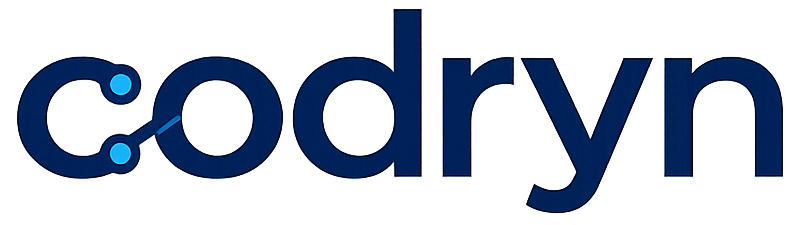

<p align="center">
  
</p>

<p align="center">
  Open-source Rust knowledge graph for AI coding agents.
</p>

<p align="center">
  Fast indexing. Deep code understanding. Embedded web UI. Single binary.
</p>

<p align="center">
  
  
  
  
</p>

`codryn` is an open-source Rust knowledge graph and MCP server for AI coding agents, built to make large codebases easier to explore, trace, and understand.

> Based on the paper: [Codebase-memory-mcp: A Persistent Knowledge Graph for AI Coding Agents](https://arxiv.org/abs/2603.27277)

If this project is useful, give it a star. It helps more people discover the project and support continued open-source work.

## Install

```bash
curl -fsSL https://raw.githubusercontent.com/WolfCanCode/Codryn/main/install.sh | sh
```

> Tries pre-built binaries first. Falls back to building from source if none are available for your platform. Requires Rust and Node.js 20+ for source builds.

## Why this project

AI coding agents are much better when they can understand structure, not just grep files.

`codryn` indexes a repository into a persistent graph of:

- functions, classes, methods, files, and folders
- call paths and imports
- routes, DTOs, and service layers
- frontend component relationships and dependency injection
- CI/CD pipelines, jobs, stages, includes, and dependency edges
- infrastructure resources from Docker, Kubernetes, Kustomize, Helm, and Terraform-style manifests
- cross-project links between systems

That gives agents fast answers for things like:

- where a request starts and where it ends
- who calls this function
- what breaks if I change this symbol
- which files matter next
- how frontend and backend connect

## Highlights

- **Open source + MIT licensed**
- **Rust implementation** with a strong focus on speed and portability
- **Persistent knowledge graph** stored in SQLite
- **Embedded dashboard** for visual graph exploration
- **Incremental indexing** so re-runs stay fast
- **Cross-project linking** for multi-repo systems
- **46 MCP tools** for search, tracing, navigation, analysis, architecture, and agent-first operations
- **Semantic search** using all-MiniLM-L6-v2 embeddings for natural language code queries
- **CI/CD and infrastructure discovery** for GitHub Actions, GitLab CI, CircleCI, Azure Pipelines, Bitbucket Pipelines, Jenkinsfile-style jobs, Docker, Kubernetes, Kustomize, Helm, and Terraform resources
- **64 language detection** plus tree-sitter walkers for Rust, TypeScript, JavaScript, Python, Go, Java, Kotlin, Dart, Lua, Haskell, C/C++, C#, Ruby, PHP, Swift, Scala, Elixir, and Bash
- **Agent-first tools**: `what_if`, `ask_graph`, `plan_refactoring`, `detect_patterns`, `semantic_search`, `generate_openapi`
- **Confidence scoring** on every graph edge (0.0–1.0 provenance)
- **Single binary** with no Docker required

## What makes it interesting

- **Built for AI agents**: not just search, but graph-aware navigation and analysis
- **Framework-aware**: strong support for Spring Boot, Angular, Vue, FastAPI, Go, and Next.js
- **Useful locally**: run as an MCP server or open the web UI
- **Practical architecture**: one workspace, one binary, one local graph store

## MCP tools

Some of the most useful tools (46 total):

| Tool | Description |
|---|---|
| `index_repository` | Build the graph for a repository |
| `find_symbol` | Fast ranked symbol lookup by name |
| `get_symbol_details` | Full context: callers, callees, imports, inheritance |
| `find_references` | Find symbol usage through graph edges |
| `impact_analysis` | Estimate what a change will affect |
| `what_if` | Predict breakages from rename/remove/change |
| `trace_call_path` | Follow calls between functions |
| `trace_backend_flow` | Trace route → controller → service → repository |
| `get_architecture` | Summarize packages, modules, and code shape |
| `get_project_summary` | Onboarding brief in one call |
| `find_routes` | Discover API routes and DTO relationships |
| `find_dead_code` | Find unused symbols |
| `detect_patterns` | Detect design patterns and antipatterns |
| `plan_refactoring` | Step-by-step refactoring plans |
| `semantic_search` | Natural language code search |
| `generate_openapi` | Generate OpenAPI spec from routes |
| `get_api_surface` | Public API with optional diff |
| `dep_freshness` | Check for outdated dependencies |
| `ask_graph` | Plain English questions about code |
| `suggest_next_reads` | Help agents decide what to inspect next |
| `find_pipelines` | Discover CI/CD pipelines |
| `find_infrastructure` | Discover Docker, Kubernetes, Helm, Terraform resources |

> Full tool reference: [docs/MCP_TOOLS.md](docs/MCP_TOOLS.md)

## CLI

```
codryn                        Run as MCP server on stdin/stdout
codryn install                Auto-configure coding agents (interactive)
codryn status                 Show agent installation status
codryn activate [--global]    Activate steering for workspace
codryn query <tool> [--args]  Run MCP tool as CLI command
codryn validate --project P   Validate graph consistency
codryn dedupe --project P     Deduplicate graph nodes
codryn complexity --project P Report complex symbols
codryn deps --project P       List/check dependencies
codryn backup [path]          Back up the graph database
codryn --ui [--port=N]        Enable web UI (default port 9749)
```

## Architecture

```text
crates/
├── codryn-foundation    — Config, platform detection, utilities
├── codryn-store         — SQLite graph store with pooling & embeddings
├── codryn-discover      — 64-language file discovery
├── codryn-pipeline      — Multi-pass indexing with checkpoints
├── codryn-treesitter    — 30+ AST walkers
├── codryn-graph-buffer  — Batch graph operations with confidence
├── codryn-cypher        — Cypher → SQL query engine
├── codryn-services      — Navigation, flow, analysis, semantic search
├── codryn-mcp           — 46 MCP tool handlers
├── codryn-cli           — Interactive install, validate, query, etc.
├── codryn-ui            — Web dashboard (React + embedded assets)
├── codryn-watcher       — File system watcher
├── codryn-bench         — Performance benchmarks
└── codryn-bin           — App binary

ui/
└── React/Vite dashboard for graph exploration
```

## Local run

```bash
cargo build --release
./target/release/codryn --ui
```

Then open `http://127.0.0.1:9749`.

## Supported languages

Supports 64 language mappings, including Rust, TypeScript, JavaScript, Java, Kotlin, Python, Go, Dart, Lua, Haskell, C, C++, C#, PHP, Ruby, Scala, Swift, Elixir, SQL, HTML, CSS, Vue, Svelte, Bash, Dockerfile, YAML, and more. Deep tree-sitter walkers for 30+ languages with error-tolerant AST recovery.

## Open source

This project is MIT licensed and intended to be easy to use, inspect, extend, and contribute to.

## License

MIT

## References

- [Codebase-memory-mcp paper](https://arxiv.org/abs/2603.27277)
- [Original upstream inspiration](https://github.com/DeusData/codebase-memory-mcp)
