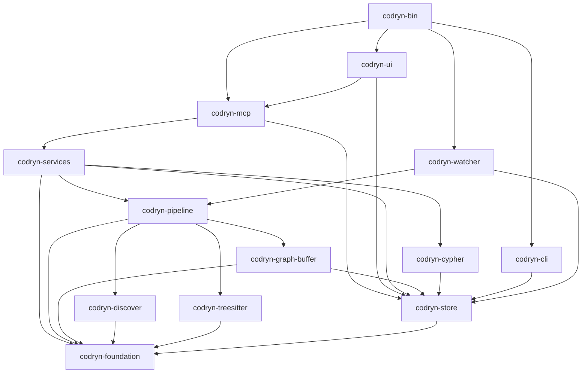
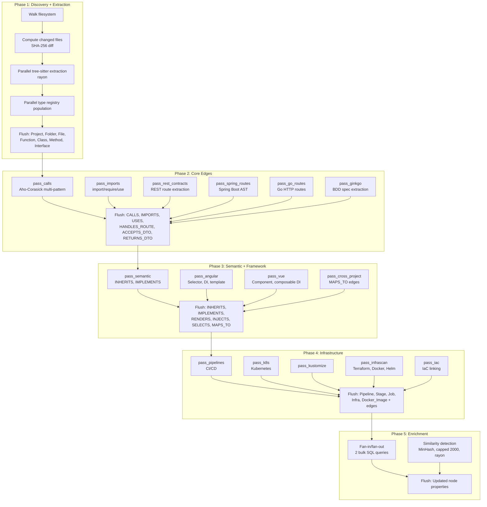
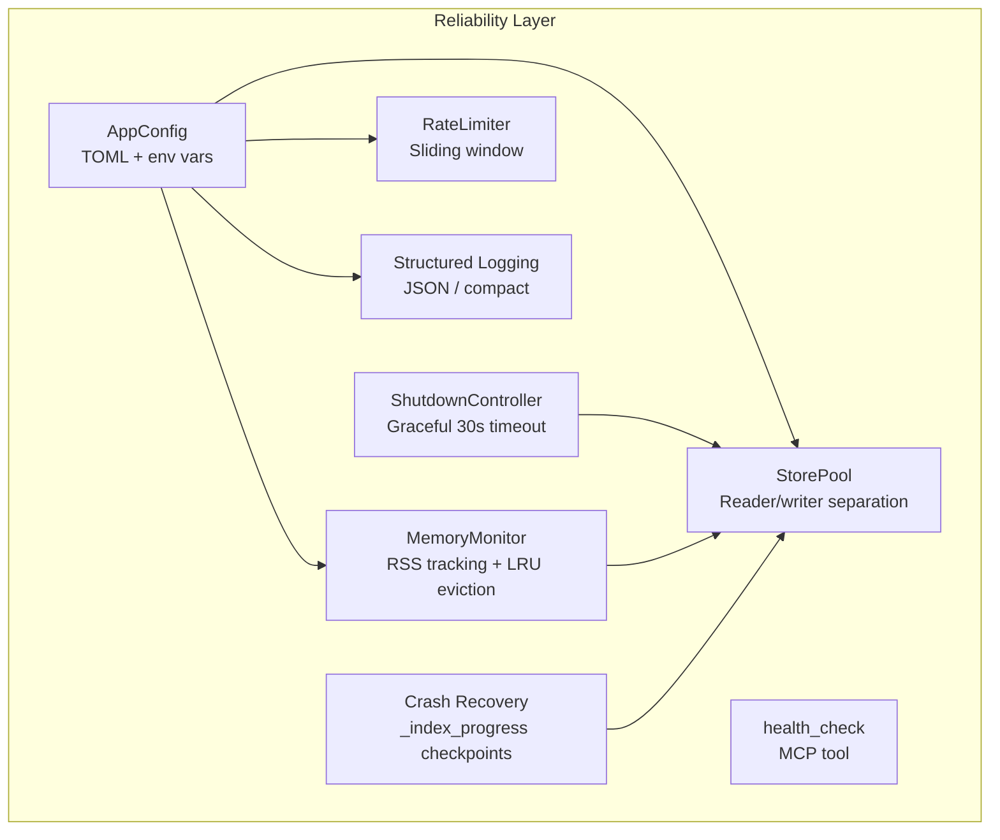
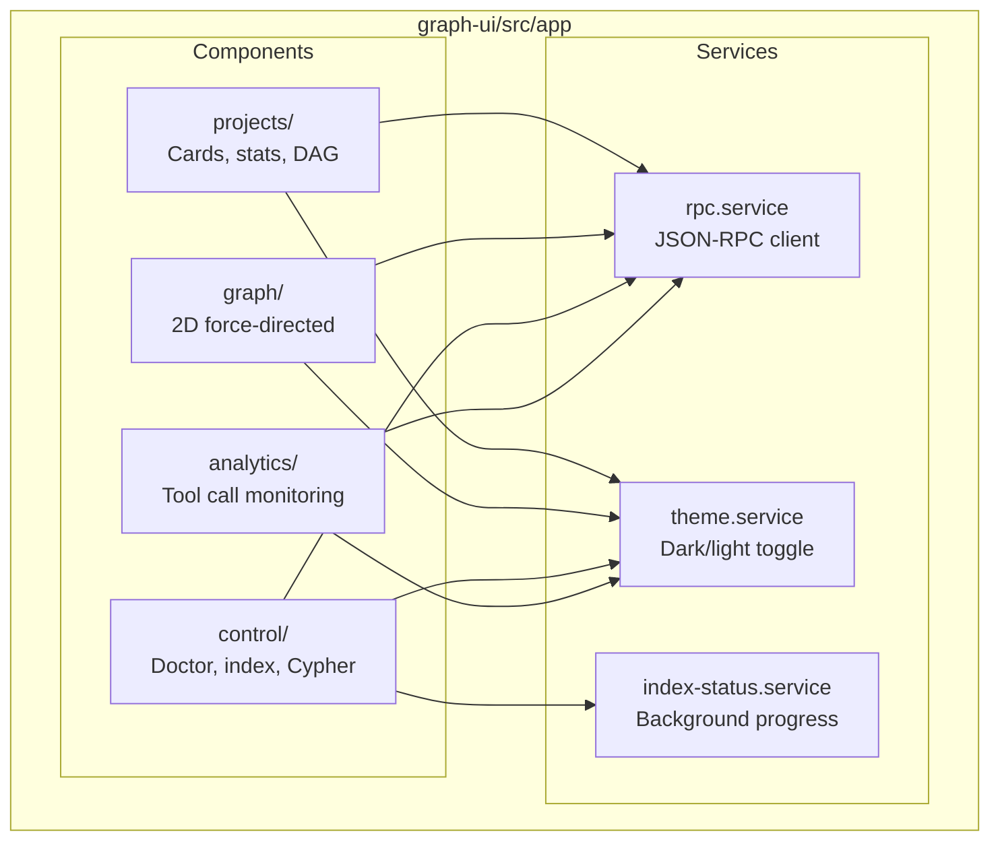
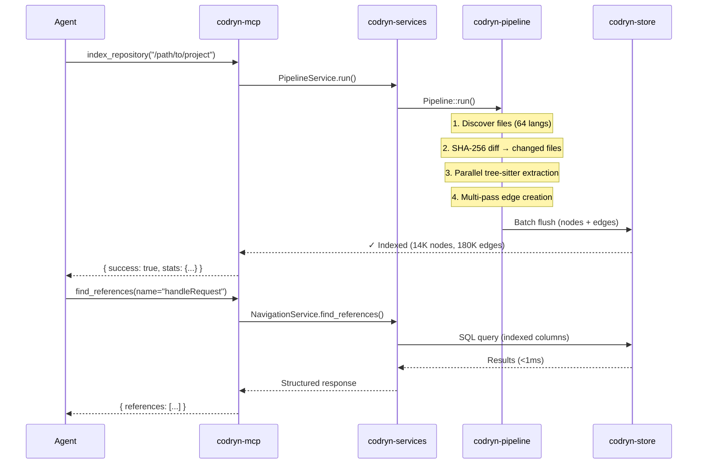
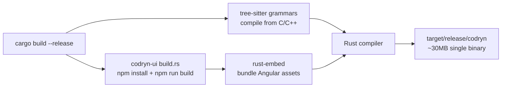

# Architecture

Deep technical reference for the `codryn` system. For a high-level overview, see the [README](../README.md). For design rationale, see [TECHNICAL_DECISIONS.md](TECHNICAL_DECISIONS.md).

---

## System Overview

```mermaid
graph TD
    subgraph "codryn binary"
        subgraph "Interface Layer"
            MCP[codryn-mcp<br/>MCP Server · stdio]
            UI[codryn-ui<br/>HTTP + Angular]
            WATCH[codryn-watcher<br/>File Watch]
            CLI[codryn-cli<br/>install · doctor · update<br/>validate · dedupe · deps<br/>complexity · doc-coverage<br/>query · symbol · refs · impact]
        end

        subgraph "Service Layer"
            NAV[NavigationService]
            FLOW[FlowAnalysisService]
            BFLOW[BackendFlowService]
            ARCH[ArchitectureService]
            TEST[TestDiscoveryService]
            LINK[ProjectLinkingService]
            PIPE_SVC[PipelineService]
            ANALYTICS[AnalyticsService]
            WI[WhatIfService]
            DC[DeadCodeService]
            DG[DependencyGraphService]
            STALE[StalenessService]
            NLC[NLToCypherService]
            REF[RefactoringService]
            PAT[PatternDetectionService]
            TG[TestGapService]
            EC[ErrorChainService]
            API[APISurfaceService]
            SUMMARY[ProjectSummaryService]
            CTX[ContextForTaskService]
            BATCH[SymbolBatchService]
        end

        subgraph "Engine Layer"
            CYPHER[codryn-cypher<br/>Cypher → SQL]
            PIPELINE[codryn-pipeline<br/>Multi-pass indexing]
            STORE[codryn-store<br/>SQLite graph store]
        end

        subgraph "Foundation Layer"
            DISC[codryn-discover<br/>File walking · 64 langs]
            TS[codryn-treesitter<br/>14 AST walkers]
            BUF[codryn-graph-buffer<br/>Batch staging]
            FND[codryn-foundation<br/>FQN · strings · platform]
        end
    end

    subgraph "External"
        ANGULAR[graph-ui<br/>Angular 19 dashboard<br/>embedded via rust-embed]
    end

    MCP --> NAV & FLOW & BFLOW & ARCH & TEST & LINK & PIPE_SVC & ANALYTICS
    UI --> NAV & FLOW & BFLOW & ARCH & TEST & LINK & PIPE_SVC & ANALYTICS

    NAV & FLOW & BFLOW & ARCH & TEST --> STORE
    NAV & FLOW & BFLOW --> CYPHER
    PIPE_SVC --> PIPELINE
    LINK --> STORE
    ANALYTICS --> STORE

    PIPELINE --> DISC & TS & BUF
    BUF --> STORE
    CYPHER --> STORE

    DISC --> FND
    TS --> FND
    STORE --> FND

    ANGULAR -.->|embedded at build time| UI
```



---

## Crate Dependency Graph



---

## Crate Details

### codryn-foundation

The lowest-level crate. Zero external dependencies beyond `std`.

| Module | Purpose |
|:-------|:--------|
| `fqn.rs` | Fully-qualified name construction and manipulation |
| `str_intern.rs` | String interning for memory-efficient symbol storage |
| `str_util.rs` | String utilities (case conversion, path normalization) |
| `platform.rs` | OS detection, home directory, config paths |
| `scope_matching.rs` | Scope/folder pattern matching for filtering |
| `minhash.rs` | MinHash similarity detection between functions |
| `complexity.rs` | Cyclomatic complexity estimation |
| `arena.rs` | Arena allocator for batch processing |

### codryn-discover

File system discovery with smart filtering.

| Feature | Detail |
|:--------|:-------|
| Directory walking | Respects `.gitignore` rules (via `ignore` crate) |
| Language detection | 64 languages by file extension |
| User config | Custom mappings via `~/.codryn/languages.toml` |
| Output | `FileSet` grouped by language |

### codryn-treesitter

AST extraction using tree-sitter grammars.

| Walker | Languages |
|:-------|:----------|
| `ts_walker.rs` | TypeScript, TSX, JavaScript |
| `python_walker.rs` | Python |
| `rust_walker.rs` | Rust |
| `c_walker.rs` | C, C++ |
| `csharp_walker.rs` | C# |
| `ruby_walker.rs` | Ruby |
| `php_walker.rs` | PHP |
| `scala_walker.rs` | Scala |
| `swift_walker.rs` | Swift |
| `elixir_walker.rs` | Elixir |
| `bash_walker.rs` | Bash |

**Framework adapters** (in `codryn-pipeline`):

| Adapter | What it extracts |
|:--------|:-----------------|
| `spring_java.rs` / `spring_kotlin.rs` | Spring Boot annotations, routes, DTOs, layers |
| `angular_adapter.rs` | Selectors, constructor DI, template composition, layers |
| `vue_adapter.rs` | Component names, composable DI, template RENDERS |
| `go_adapter.rs` | HTTP routes, interfaces, Ginkgo BDD specs |

### codryn-store

SQLite-backed graph storage.

**Schema:**

| Table | Columns | Purpose |
|:------|:--------|:--------|
| `nodes` | id, project, label, name, qualified_name, file_path, start_line, end_line, properties | Core graph nodes |
| `edges` | id, project, source_id, target_id, type, properties, confidence, edge_source | Core graph edges (with confidence scoring) |
| `file_hashes` | project, file_path, hash, is_deleted | Incremental indexing state |
| `project_links` | source_project, target_project, created_at | Cross-project links |
| `tool_calls` | id, tool_name, project, source, agent_name, model_name, duration_ms, success, request_body, response_body, called_at | Analytics |
| `code_fts` | rowid, content | FTS5 full-text search |
| `decisions` | id, project, title, content, created_at | Architecture Decision Records |
| `_index_progress` | project, phase, phase_index, files_processed, started_at, completed, run_id | Crash recovery checkpoints |
| `_index_runs` | id, project, mode, status, git_commit, started_at, completed_at, node_count, edge_count, error | Index run tracking |
| `_snapshots` | id, project, node_count, edge_count, label_counts, content_hash, created_at | Historical graph snapshots |

**Connection pooling:**

| Feature | Detail |
|:--------|:-------|
| Reader/writer separation | Multiple concurrent readers, exclusive writer |
| Pool size | Configurable (default: 4 readers) |
| Busy timeout | 10s default, configurable |
| Connection reset | State cleaned on return to pool |
| Metrics | Active/idle counts for diagnostics |

**Node labels:**

| Label | Examples |
|:------|:---------|
| Project | Root project node |
| Folder | Directory in the tree |
| File | Source file |
| Module | Logical module (file-level) |
| Function | Standalone function |
| Class | Class definition |
| Method | Method inside a class |
| Interface | Interface/trait/protocol |
| Route | REST/HTTP endpoint |
| Selector | Angular/Vue component selector |
| Pipeline, Stage, Job | CI/CD pipeline structure |
| Infra, Docker_Image | Infrastructure resources |

**Edge types:**

| Category | Edge types |
|:---------|:-----------|
| Structure | CONTAINS |
| Code | CALLS, IMPORTS, INHERITS, IMPLEMENTS, USES, TYPE_REF, OVERRIDES, DELEGATES_TO |
| REST | HANDLES_ROUTE, ACCEPTS_DTO, RETURNS_DTO, HTTP_CALLS |
| Framework | RENDERS, INJECTS, SELECTS, MAPS_TO, CONFIGURES |
| Infrastructure | DEPENDS_ON, DEPLOYS, BUILDS_IMAGE, USES_IMAGE, NEXT_STAGE, BELONGS_TO_STAGE |

**Performance features:**

| Feature | Benefit |
|:--------|:--------|
| WAL mode | Concurrent reads during indexing |
| Bulk indexing mode | Disables FK checks, increases WAL interval |
| Batch QN resolution | Chunked `IN (...)` queries (500/batch) |
| `BEGIN IMMEDIATE` | Avoids BUSY retries during bulk writes |
| Memory-mapped I/O | 256MB mmap during indexing |
| Busy timeout (10s) | UI reads don't fail during indexing |

### codryn-graph-buffer

In-memory staging area between the pipeline and the store.

| Feature | Detail |
|:--------|:-------|
| Accumulation | Collects nodes and edges during pipeline passes |
| Batch resolution | Resolves qualified names to node IDs in bulk |
| Merge | `merge_from()` combines parallel pass buffers |
| Flush strategy | 5 phases: structure → core edges → semantic → infra → enrichment |

### codryn-pipeline

The multi-pass indexing engine. This is the largest and most complex crate.



**Incremental optimization:**

| Strategy | When applied |
|:---------|:------------|
| Only changed files re-extracted | Always |
| `pass_calls` on changed + 1-hop dependents | <10% files changed |
| Framework passes on changed files only | <10% files changed |
| Full re-scan fallback | ≥10% files changed |
| Registry always rebuilt from all files | Always (for cross-file resolution) |

**Progress reporting:**

| Feature | Detail |
|:--------|:-------|
| Callback architecture | `ProgressUpdate` struct with phase + percent |
| Granularity | Reports every 100 files during extraction |
| Messages | Human-readable ("Resolving function calls...") |
| Timing | Per-phase elapsed time logged at completion |

### codryn-cypher

A lightweight Cypher query engine that translates to SQL.

**Supported syntax:**

| Feature | Example |
|:--------|:--------|
| Pattern matching | `MATCH (n:Function)-[r:CALLS]->(m)` |
| Filtering | `WHERE n.name = 'main' OR m.file_path CONTAINS 'auth'` |
| Projection | `RETURN n.name, m.name, r.type` |
| Ordering | `ORDER BY n.name` |
| Limiting | `LIMIT 20` |
| Variable-length paths | `MATCH (a)-[*1..3]->(b)` |
| Union | `MATCH ... RETURN ... UNION MATCH ... RETURN ...` |
| Boolean logic | `WHERE ... AND ... OR ... NOT ...` |

**Components:**

| File | Role |
|:-----|:-----|
| `lexer.rs` | Tokenizer (keywords, identifiers, operators, strings, numbers) |
| `parser.rs` | Recursive descent parser → AST |
| `executor.rs` | AST → SQL translation + execution against `codryn-store` |

### codryn-services

High-level business logic services consumed by `codryn-mcp`.

| Service | Responsibility |
|:--------|:---------------|
| `NavigationService` | Symbol lookup, references, impact analysis, entrypoints |
| `FlowAnalysisService` | Data flow tracing, call path traversal |
| `BackendFlowService` | Route→controller→service→repository chain detection |
| `ArchitectureService` | Module structure, layer classification |
| `TestDiscoveryService` | Test file/symbol matching by convention + graph |
| `PipelineService` | Index orchestration, progress, incremental logic |
| `ProjectLinkingService` | Cross-project link management, auto-linking |
| `AnalyticsService` | Tool call tracking, token savings estimation |
| `WhatIfService` | Rename/remove/change_signature/move_file impact prediction |
| `DeadCodeService` | Zero-reference symbol detection |
| `DependencyGraphService` | Module dependency graph with cycle detection |
| `StalenessService` | File hash comparison, freshness scoring |
| `NLToCypherService` | Natural language → Cypher translation |
| `RefactoringService` | Step-by-step refactoring plan generation |
| `PatternDetectionService` | MVC, God Class, circular dependency detection |
| `TestGapService` | Untested symbol identification, coverage ratios |
| `ErrorChainService` | Uncaught error propagation tracing |
| `APISurfaceService` | Exported symbol inventory |
| `ProjectSummaryService` | Structured onboarding brief generation |
| `ContextForTaskService` | Task-oriented context gathering (modify/debug/test/document) |
| `SymbolBatchService` | Batch symbol resolution with internal edge discovery |

### codryn-mcp

The MCP server implementation using `rmcp` (official Rust MCP SDK).

| Feature | Detail |
|:--------|:-------|
| Protocol | Stdio JSON-RPC 2.0 |
| Tools | 46 handlers mapped to service methods |
| Auto-index | Triggers on first tool call if project not indexed |
| Analytics | Tracks agent name, model, duration, request/response |
| Diagnostics | Warns when graph is incomplete |
| Health check | `health_check` tool returns status, uptime, version, store health |
| Query cache | In-process TTL cache with per-project invalidation on reindex |
| Cross-process lock | `flock(LOCK_EX)` on `index.lock` serializes concurrent pipeline runs |
| Graceful shutdown | `ShutdownController` with 30s timeout, completes in-progress flushes |
| Rate limiting | Sliding window per-session, configurable threshold, exemptions |
| Structured logging | JSON or compact format, per-module levels, env var config |

### codryn-ui

Axum HTTP server that serves the Angular dashboard.

| Feature | Detail |
|:--------|:-------|
| Asset serving | `rust-embed` embeds compiled Angular into binary |
| RPC proxy | `/rpc` endpoint proxies JSON-RPC to MCP layer |
| REST API | `/api/*` for UI-specific operations |
| Binding | `127.0.0.1:9749` (localhost only) |

### codryn-cli

Command-line interface for installation and management.

| Command | Action |
|:--------|:-------|
| `codryn install` | Auto-detect agents, write MCP configs + steering files + skills |
| `codryn uninstall` | Remove all agent configurations |
| `codryn status` | Check which agents are configured |
| `codryn update` | Self-update from source |
| `codryn doctor` | Diagnose common issues |
| `codryn validate` | Check graph structural integrity |
| `codryn dedupe` | Detect and merge duplicate nodes |
| `codryn index-runs` | List recent index runs |
| `codryn snapshots` | List historical graph snapshots |
| `codryn diff` | Compare two snapshots |
| `codryn complexity` | Report most complex symbols |
| `codryn doc-coverage` | Documentation coverage by module |
| `codryn deps` | List dependencies from manifest files |
| `codryn query` | Execute raw Cypher queries |
| `codryn symbol` | Find symbols by name |
| `codryn refs` | Find incoming references |
| `codryn impact` | Impact analysis from CLI |
| `codryn backup` | Back up the graph database |
| `codryn restore` | Restore from backup |

### codryn-watcher

Background file system watcher using the `notify` crate.

| Feature | Detail |
|:--------|:-------|
| Monitoring | Watches indexed project directories |
| Debouncing | 500ms window for rapid changes |
| Action | Triggers incremental re-index on create/modify/delete |
| Threading | Runs in background alongside MCP server |

### codryn-bin

Binary entry point and mode dispatch.

| Feature | Detail |
|:--------|:-------|
| Argument parsing | `--ui`, `--port`, `--version`, `--help` |
| Mode dispatch | MCP server mode or UI mode |
| Signal handling | Graceful shutdown on SIGINT/SIGTERM |
| Logging | Initializes tracing with `RUST_LOG` env filter |

---

## Reliability & Operations

Features implemented in Track 6 for production hardening:



| Component | Location | Purpose |
|:----------|:---------|:--------|
| `AppConfig` | `codryn-foundation` | TOML config from `~/.config/codryn/config.toml` with env var overrides |
| `StorePool` | `codryn-store` | Reader/writer connection pool (4 readers, exclusive writer) |
| `ShutdownController` | `codryn-mcp` | SIGTERM/SIGINT handling, 30s timeout, completes in-progress flushes |
| `MemoryMonitor` | `codryn-pipeline` | RSS tracking, 80% threshold flush, LRU eviction at 10k entries |
| `health_check` | `codryn-mcp` | MCP tool: status, uptime, version, store health, active indexes |
| `IndexCheckpoint` | `codryn-store` | Crash recovery: saves phase progress, resumes from interruption |
| `RateLimiter` | `codryn-mcp` | Sliding window, per-session, exemptions for index/health |
| Structured logging | `codryn-mcp` | JSON or compact format, per-module levels, `CBM_LOG_FORMAT` env |

### Configuration

`~/.config/codryn/config.toml`:

```toml
log_level = "info"              # or "debug", "trace", per-module: "codryn_pipeline=debug"
log_format = "compact"          # or "json"
max_memory_mb = 512             # memory pressure threshold
pool_size = 4                   # SQLite reader connections

[rate_limit]
window_seconds = 60
max_calls = 100
max_expensive = 10              # expensive tools (impact_analysis, trace_*)
```

Environment variables override config file values (`CBM_LOG_LEVEL`, `CBM_LOG_FORMAT`, `CBM_MAX_MEMORY_MB`).

---

## Angular Dashboard (graph-ui)

Angular 19 application with signal-based reactivity.



| Library | Purpose |
|:--------|:--------|
| `force-graph` | 2D force-directed graph, Canvas rendering, quadtree hit-testing |
| SDX web components | Swisscom Design System for UI consistency |
| Custom Canvas 2D | Project relationship DAG (deterministic layout) |

**Build:** `npm run build` → static assets → `rust-embed` bundles into Rust binary. Node.js only needed at build time.

---

## Data Flow: Index → Query



---

## Key Dependencies

| Crate | Version | Purpose |
|:------|:--------|:--------|
| `rmcp` | 0.3 | Official Rust MCP SDK (stdio JSON-RPC 2.0) |
| `rusqlite` | 0.32 | SQLite with bundled source (zero system deps) |
| `tree-sitter` | 0.25 | AST parsing framework |
| `tree-sitter-*` | various | 14+ language grammars |
| `axum` | 0.8 | HTTP server for dashboard |
| `tokio` | 1.x | Async runtime |
| `rayon` | 1.x | Parallel processing |
| `notify` | 7.x | File system watcher |
| `aho-corasick` | 1.x | Multi-pattern matching for call resolution |
| `rust-embed` | 8.x | Embed Angular assets into binary |
| `serde` / `serde_json` | 1.x | Serialization |
| `git2` | 0.19 | Git operations (change detection) |
| `sha2` | 0.10 | File content hashing |
| `lz4_flex` | 0.11 | Code snippet compression |
| `regex` | 1.x | Pattern matching fallback |
| `ignore` | 0.4 | .gitignore-aware file walking |

---

## Build Process



| Step | What happens |
|:-----|:-------------|
| 1 | `codryn-ui/build.rs` triggers `npm install` + `npm run build` in `graph-ui/` |
| 2 | tree-sitter grammars compile from C/C++ source (14+ languages) |
| 3 | `rust-embed` bundles the Angular build output |
| 4 | Rust compiler produces a single static binary |

The final binary is ~30MB with zero runtime dependencies. Node.js is not needed at runtime.

---

## Performance Characteristics

| Metric | Value | Notes |
|:-------|:------|:------|
| Cold start | <10ms | Binary starts instantly (no runtime to boot) |
| Index 10k LOC | ~1s | Parallelized across CPU cores |
| Index 50k LOC | ~3s | Incremental: <1s for 5 changed files |
| Query latency | <1ms | SQLite with indexed columns |
| Peak memory | ~80MB | For 50k+ file projects (batch flushing) |
| Binary size | ~30MB | Includes embedded Angular UI |
| Storage | ~50MB | Typical graph.db for a large project |

---

## Security Model

| Property | Detail |
|:---------|:-------|
| Network | No network access in MCP mode; localhost-only in UI mode |
| Credentials | No API keys, no auth tokens, no cloud accounts |
| Telemetry | No outbound requests, no usage tracking |
| Storage | All data in `~/.codryn/store/graph.db`, delete to reset |
| Code signing | macOS binary is ad-hoc signed for Gatekeeper |

See [SECURITY.md](SECURITY.md) for the full security document.
