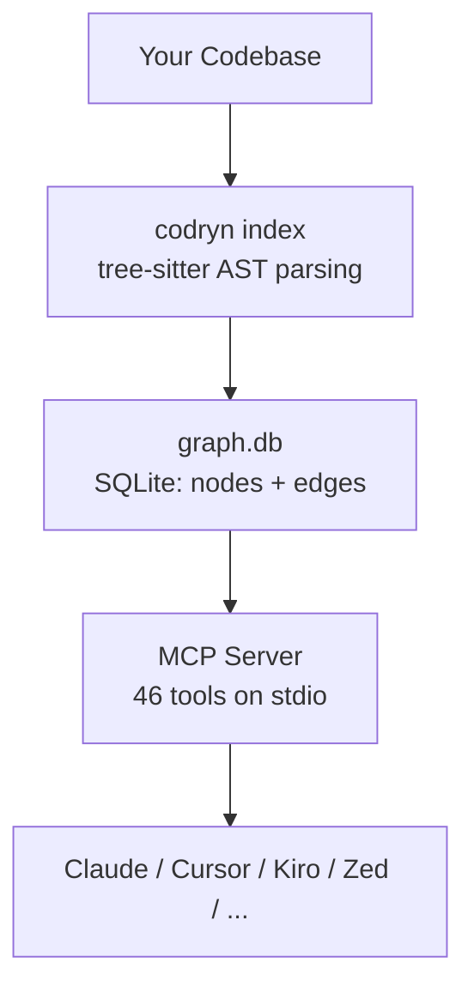
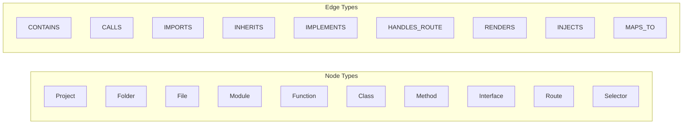
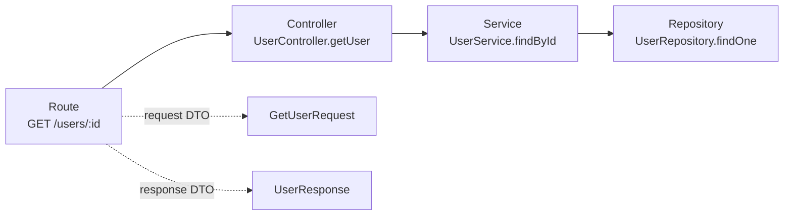
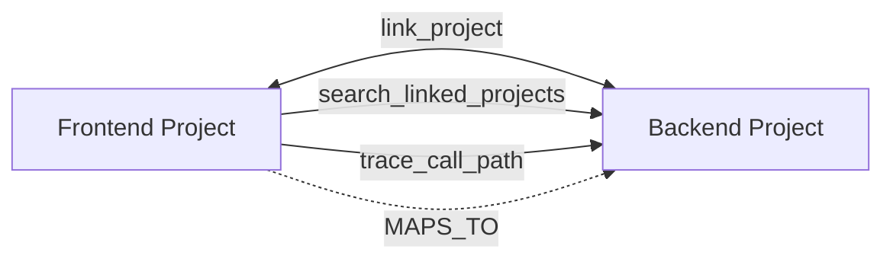

# How It Works

## The Problem

AI coding agents are stateless. Every new session, they have no memory of your codebase. They can't answer "What calls `processPayment`?" without reading every file — slow, expensive, and incomplete.

## The Solution

`codryn` builds a **persistent knowledge graph** and exposes it via [MCP](https://modelcontextprotocol.io/). The agent queries the graph instead of reading raw files.



The graph persists between sessions. Your agent always has structural knowledge without re-reading files.

---

## Indexing Pipeline

When you run `index_repository`, the pipeline runs in 5 phases:

```mermaid
flowchart TD
    subgraph "Phase 1 — Structure + Definitions"
        P1A[Walk filesystem with .gitignore]
        P1B[SHA-256 diff → changed files only]
        P1C[Parallel tree-sitter extraction]
        P1D[Create Project, Folder, File,<br/>Function, Class, Method, Interface nodes]
    end

    subgraph "Phase 2 — Core Edges"
        P2A[pass_calls — Aho-Corasick multi-pattern matching]
        P2B[pass_imports — import/require/use parsing]
        P2C[pass_spring_routes — Spring Boot AST extraction]
        P2D[pass_go_routes — Go HTTP route detection]
        P2E[pass_ginkgo — BDD spec extraction]
        P2F[pass_c_preprocessor — #define macros, #include edges]
        P2G[pass_fastapi_depends — Depends() injection graph]
    end

    subgraph "Phase 3 — Semantic + Framework"
        P3A[pass_semantic — INHERITS, IMPLEMENTS]
        P3B[pass_angular — Selector, DI, template, layers]
        P3C[pass_vue — Component, composable DI, RENDERS]
        P3D[pass_cross_project — MAPS_TO edges]
    end

    subgraph "Phase 4 — Infrastructure"
        P4A[CI/CD pipelines — GitLab, GitHub Actions, Jenkins]
        P4B[Kubernetes, Terraform, Docker, Helm]
    end

    subgraph "Phase 5 — Enrichment"
        P5A[Fan-in/fan-out computation]
        P5B[Similarity detection — MinHash, rayon parallel]
        P5C[Complexity metrics — cyclomatic + cognitive]
        P5D[Documentation coverage scoring]
    end

    P1A --> P1B --> P1C --> P1D
    P1D --> P2A & P2B & P2C & P2D & P2E & P2F & P2G
    P2A & P2B & P2C & P2D & P2E & P2F & P2G --> P3A & P3B & P3C & P3D
    P3A & P3B & P3C & P3D --> P4A & P4B
    P4A & P4B --> P5A & P5B & P5C & P5D
```

### Pass Details

| Pass | What it does |
|:-----|:-------------|
| **Structure** | Creates Project, Folder, File nodes from directory tree with CONTAINS edges |
| **Definitions** | Parses every source file with tree-sitter (64 languages). Extracts Function, Class, Method, Interface nodes with qualified names and line ranges |
| **Calls** | Aho-Corasick multi-pattern matching finds call sites. Resolves which function contains each call using line ranges. Creates CALLS edges |
| **Imports** | Parses import/require/use statements in parallel. Creates IMPORTS edges between modules |
| **Spring Routes** | tree-sitter AST extraction for `@RestController` endpoints. Creates Route nodes + HANDLES_ROUTE, ACCEPTS_DTO, RETURNS_DTO edges |
| **Go Routes** | Detects HTTP routes from net/http, Gin, Echo, Chi, Fiber, Gorilla. Supports Go 1.22+ embedded method patterns |
| **Ginkgo** | Extracts BDD specs (Describe, Context, It, BeforeEach) as Function nodes with nested hierarchy |
| **C/C++ Preprocessor** | Extracts `#define` macros as Constant nodes and `#include "..."` as INCLUDES edges. System headers skipped |
| **FastAPI Depends** | Extracts `Depends(fn)` patterns from Python route handlers. Creates INJECTS edges with chain depth |
| **Semantic** | Detects class inheritance and interface implementation. Creates INHERITS and IMPLEMENTS edges |
| **Angular** | Selector nodes, constructor DI (INJECTS), template composition (RENDERS), layer classification |
| **Vue** | Component names, composable DI (INJECTS), template RENDERS, selector indexing |
| **Cross-Project** | Finds same-name types across linked projects. Creates MAPS_TO edges |
| **Infrastructure** | Parses CI/CD, Kubernetes, Terraform, Docker, Helm. Creates Pipeline, Stage, Job, Infra nodes |
| **Enrichment** | Computes fan-in/fan-out (2 bulk SQL queries). Runs MinHash similarity detection (capped at 2000 functions). Computes cyclomatic and cognitive complexity. Scores documentation coverage |

### Incremental Indexing

| Strategy | Detail |
|:---------|:-------|
| File hashing | SHA-256 per file, only re-parse changed files |
| Cross-process locking | `flock(LOCK_EX)` on `index.lock` serializes all pipeline runs across processes |
| Registry rebuild | Always rebuilt from all files for cross-file call resolution |
| 1-hop dependents | `pass_calls` includes files that import changed files |
| 10% threshold | When ≥10% files changed, falls back to full re-scan |
| Stale detection | Deleted files marked `is_deleted`, excluded from queries |
| Fast vs Full mode | Fast mode upserts nodes and rebuilds edges only; Full mode deletes all edges and rebuilds from scratch |

---

## The Graph Model



| Edge type | Meaning | Example |
|:----------|:--------|:--------|
| CONTAINS | Parent → child | Folder → File, File → Function |
| CALLS | Caller → callee | `main()` → `handleRequest()` |
| IMPORTS | Importer → imported | `auth.ts` → `utils.ts` |
| INHERITS | Subclass → superclass | `AdminUser` → `User` |
| IMPLEMENTS | Class → interface | `UserService` → `IUserService` |
| HANDLES_ROUTE | Method → route | `getUser()` → `GET /users/{id}` |
| ACCEPTS_DTO | Route → request body | `POST /users` → `CreateUserDto` |
| RETURNS_DTO | Route → response | `GET /users/{id}` → `UserResponse` |
| RENDERS | Component → child component | `AppComponent` → `UserCardComponent` |
| INJECTS | Consumer → service | `UserComponent` → `UserService` |
| SELECTS | Selector → component | `app-user-card` → `UserCardComponent` |
| MAPS_TO | Cross-project type match | Frontend `User` → Backend `User` |

Nodes have a `qualified_name` — a dot-separated path like `myproject.src.auth.validateToken` — which uniquely identifies any symbol across the entire codebase.

### Edge Confidence

Every edge carries a `confidence` score (0.0–1.0) and `edge_source` indicating how it was derived:

| Source | Confidence | Example |
|:-------|:----------:|:--------|
| Compiler/LSP index | 0.95–0.98 | External LSP-derived edges |
| AST structural | 0.90 | tree-sitter walker extraction |
| Dedicated adapter | 0.85 | Spring Boot, Angular, Vue, Go adapters |
| Import resolver | 0.82 | `pass_imports` resolution |
| AST name match | 0.60 | Aho-Corasick call matching |
| Regex match | 0.45 | Regex-based pattern matching |
| Heuristic | 0.30 | Fallback heuristic detection |

Agents can filter by confidence using `min_confidence` on `find_references`, `impact_analysis`, and `trace_call_path`.

---

## Why MCP?

| Property | Benefit |
|:---------|:--------|
| Agent-agnostic | Works with any MCP-compatible agent |
| No plugin needed | One binary serves all agents via the same protocol |
| Tool discovery | Agents automatically discover available tools |
| Stdio transport | Simple, reliable, no port management |

The agent decides when to query the graph — it's just another tool in its toolbox.

---

## What the Agent Can Do

| Question | Tool | How it works |
|:---------|:-----|:-------------|
| "Find `getUserProfile`" | `find_symbol` | Ranked name/QN lookup |
| "What calls `handleRequest`?" | `find_references` | Graph edge traversal |
| "What breaks if I change this?" | `impact_analysis` | Multi-hop dependent analysis |
| "What breaks if I rename this?" | `what_if` | Breakage prediction + fix plan |
| "Show call path from A to B" | `trace_call_path` | BFS/DFS on CALLS edges |
| "What's the module structure?" | `get_architecture` | Folder/module hierarchy |
| "Trace this endpoint's flow" | `trace_backend_flow` | Route→controller→service→repo |
| "Find all REST routes" | `find_routes` | Route node query |
| "Which tests cover this?" | `find_tests_for_target` | Convention + graph matching |
| "Search the backend project" | `search_linked_projects` | Cross-project graph query |
| "Why is this file missing?" | `explain_index_result` | Index diagnostics |
| "Tell me about this project" | `get_project_summary` | Structured onboarding brief |
| "Find unused code" | `find_dead_code` | Zero-reference detection |
| "Who calls X?" (natural language) | `ask_graph` | NL→Cypher translation |
| "Plan a refactoring" | `plan_refactoring` | Step-by-step refactoring plan |
| "Detect anti-patterns" | `detect_patterns` | God Class, circular deps, MVC |

---

## Backend Flow Tracing

`trace_backend_flow` explains how a request flows through a backend application:



It returns the matched route, structured flow chain, confidence score, and a renderable graph.

---

## Cross-Project Linking



| Step | What happens |
|:-----|:-------------|
| Index both projects | `index_repository` on each |
| Link them | `link_project` (bidirectional) or auto-link on index |
| Query across | `search_linked_projects` queries the other's graph |
| Trace across | `trace_call_path` auto-searches linked projects |
| Type mapping | Same-name classes get MAPS_TO edges automatically |

---

## The Web Dashboard

Running `codryn --ui` starts an HTTP server at `localhost:9749`.

| Page | What it shows |
|:-----|:--------------|
| **Projects** | Card grid with stats + interactive relationship DAG |
| **Graph** | 2D force-directed visualization with search and filters |
| **Flow** | Backend routes (controller→service→repo) + frontend components |
| **Config** | Doctor status, folder browser, Cypher console |
| **Analytics** | Agent tool call monitoring, per-tool usage, token savings |

The dashboard uses the same SQLite database as the MCP server — always reflects current state.

---

## Performance

| Metric | Value | Notes |
|:-------|:------|:------|
| Index 10k LOC | ~1s | Parallelized across CPU cores |
| Index 50k LOC | ~3s | Incremental: <1s for 5 changed files |
| Query latency | <1ms | SQLite with indexed columns |
| Peak memory | ~80MB | Batch flushing, no GC overhead |
| Similarity | Capped at 2,000 functions | Parallelized with rayon |
| Enrichment | 2 bulk SQL queries | Not per-node |
| Tree-sitter | Error-tolerant | Partial parse trees accepted |
