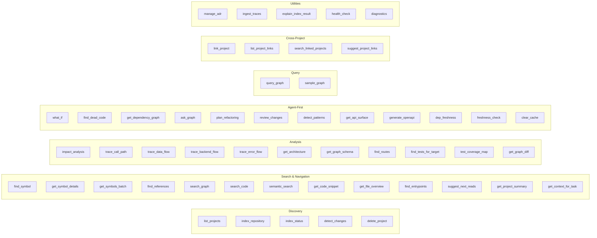
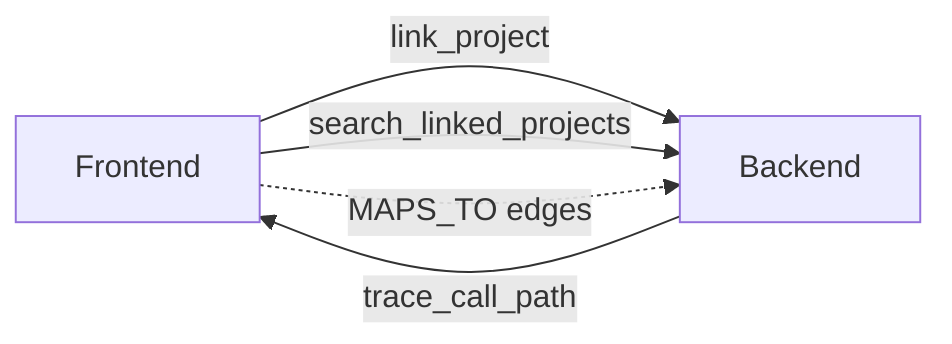

# MCP Tools Reference

`codryn` exposes **46 tools** via the [Model Context Protocol](https://modelcontextprotocol.io/). Your coding agent discovers and calls these automatically.

---

## Tool Overview



---

## Discovery

| Tool | Description | Key parameters |
|:-----|:------------|:---------------|
| `list_projects` | List all indexed projects with metadata | — |
| `index_repository` | Index a repository (full or incremental) | `path` (required), `mode` (full/fast) |
| `index_status` | Get indexing status with diagnostics and warnings | `project` |
| `detect_changes` | Detect uncommitted git changes | `project` |
| `delete_project` | Delete a project and all its graph data | `project` (required) |

---

## Search & Navigation

| Tool | Description | Key parameters |
|:-----|:------------|:---------------|
| `find_symbol` | Fast ranked symbol lookup by name or qualified name | `query` (required), `label`, `limit`, `exact` |
| `get_symbol_details` | Full context in one call: callers, callees, imports, inheritance, snippet | `name` or `qualified_name`, `include_snippet` |
| `get_symbols_batch` | Resolve multiple symbols in one call (up to 50) | `names` array or `filter` (class:X, file:Y) |
| `find_references` | Find all references to a symbol via graph edges, with confidence metadata | `name` or `qualified_name`, `reference_type`, `group_by`, `min_confidence` |
| `search_graph` | Fuzzy search across nodes (name + FTS + properties) | `query` (required), `limit` |
| `search_code` | Full-text code search across indexed source files | `pattern` (required), `limit` |
| `semantic_search` | Natural language code search using embeddings (all-MiniLM-L6-v2) | `query` (required), `limit`, `min_score` |
| `get_code_snippet` | Read source code by file + line range | `file_path` (required), `start_line`, `end_line` |
| `get_file_overview` | Compact file summary: symbols, imports, exports, neighbors | `file_path` (required) |
| `find_entrypoints` | Find main functions, route handlers, CLI commands, lambda handlers | `entry_type`, `scope`, `limit` |
| `suggest_next_reads` | Recommend next files/symbols to read, ranked by goal | `file_path` or `qualified_name`, `goal` |
| `get_project_summary` | Structured onboarding brief: languages, architecture, top symbols, patterns | `project` |
| `get_context_for_task` | Everything needed for a task (modify/debug/test/document) in one call | `name` or `qualified_name`, `task` |

---

## Analysis

| Tool | Description | Key parameters |
|:-----|:------------|:---------------|
| `impact_analysis` | Blast radius: direct/indirect dependents, affected files, risk level, confidence | `name` or `qualified_name`, `max_depth`, `limit`, `min_confidence` |
| `trace_call_path` | Trace call paths between two functions (BFS/DFS) | `source`, `target` (required), `max_depth`, `min_confidence` |
| `trace_data_flow` | Trace request/data flow with architectural pattern detection | `source`, `target`, `flow_type`, `max_depth` |
| `trace_backend_flow` | Full backend flow: route→controller→service→repository | `route_path`, `http_method`, `handler` |
| `trace_error_flow` | Trace uncaught error propagation through call chain | `symbol` (required), `max_depth` |
| `get_architecture` | High-level module/package structure with layer classification and doc coverage | `project` |
| `get_graph_schema` | Node labels, edge types, and counts | `project` |
| `get_graph_diff` | Compare two graph snapshots: node/edge deltas, per-label and per-edge-type changes | `project`, `from_id`, `to_id` |
| `find_routes` | REST/HTTP routes with handler, request DTO, and response DTO | `method`, `scope`, `limit` |
| `find_tests_for_target` | Find relevant tests by naming conventions, folder patterns, graph refs | `name` or `qualified_name`, `file_path` |
| `test_coverage_map` | Untested public symbols ranked by fan-in risk, per-module coverage | `scope`, `limit`, `untested_only` |

---

## Query

| Tool | Description | Key parameters |
|:-----|:------------|:---------------|
| `query_graph` | Execute Cypher queries against the graph | `query` (required), `include_linked` |
| `sample_graph` | High-centrality nodes sorted by degree, cyclomatic, cognitive complexity, or git hotspot | `limit`, `sort_by` (`degree`/`cyclomatic`/`cognitive`/`hotspot`) |

### Example Cypher Queries

| Query | Purpose |
|:------|:--------|
| `MATCH (f:Function) RETURN f.name LIMIT 20` | List functions |
| `MATCH (a:Function)-[:CALLS]->(b:Function) RETURN a.name, b.name` | Find call chains |
| `MATCH (c)-[:CALLS]->(f:Function) WHERE f.name = 'handleRequest' RETURN c.name` | Who calls a function |
| `MATCH (n:Function) RETURN COUNT(n)` | Count nodes by label |
| `MATCH (a)-[*1..3]->(b) WHERE a.name = 'main' RETURN b.name` | Variable-length paths |

---

## Cross-Project

| Tool | Description | Key parameters |
|:-----|:------------|:---------------|
| `link_project` | Link or unlink two projects (bidirectional) | `project`, `target_project`, `action` (link/unlink) |
| `list_project_links` | List all projects linked to a given project | `project` |
| `search_linked_projects` | Search across all linked projects' graphs (tagged with source) | `query` (required), `label`, `limit` |
| `suggest_project_links` | Suggest likely links based on shared types and naming patterns | `project`, `limit` |

### Cross-Project Flow



---

## Utilities

| Tool | Description | Key parameters |
|:-----|:------------|:---------------|
| `manage_adr` | Manage Architecture Decision Records (list, create, get) | `action` (required), `title`, `content`, `id` |
| `ingest_traces` | Ingest runtime traces to enrich the graph with CALLS edges | `traces` (required) |
| `explain_index_result` | Debug why a file or symbol is missing/incomplete in the index | `file_path` or `name` |
| `health_check` | Server health: status, uptime, version, store health, active indexes | — |
| `diagnostics` | System diagnostics: open file descriptors, query performance, health | — |

---

## Analytics Tracking

Every tool accepts an optional `analytics` parameter:

```json
{
  "analytics": {
    "agent_name": "kiro",
    "model_name": "claude-sonnet-4.6"
  }
}
```

`codryn install` writes steering files that instruct each agent to include this automatically. Calls without `analytics` show as "unknown" in the dashboard.

---

## Common Workflows

### "I'm new to this codebase"

| Step | Tool |
|:-----|:-----|
| See module structure | `get_architecture` |
| Find key entry points | `find_entrypoints` |
| Explore a symbol | `get_symbol_details` |
| Navigate connections | `suggest_next_reads` |

### "I need to change a function"

| Step | Tool |
|:-----|:-----|
| Find the function | `find_symbol` |
| See who uses it | `find_references` |
| Check blast radius | `impact_analysis` |
| Find related tests | `find_tests_for_target` |

### "Explain this API endpoint"

| Step | Tool |
|:-----|:-----|
| Find the route | `find_routes` |
| Trace the full flow | `trace_backend_flow` |
| See the DTOs | `get_symbol_details` on the DTO class |

### "Connect frontend to backend"

| Step | Tool |
|:-----|:-----|
| Link projects | `link_project` |
| Search across | `search_linked_projects` |
| Trace cross-project | `trace_call_path` (auto-crosses boundaries) |

---

## CLI Commands

In addition to MCP tools (used by agents), `codryn` provides CLI commands for local debugging and graph inspection:

| Command | Description |
|:--------|:------------|
| `codryn validate --project <p> [--fix-safe] [--json]` | Check graph structural integrity (dangling edges, orphans, duplicates) |
| `codryn dedupe --project <p> [--apply] [--json]` | Detect and merge duplicate nodes (dry-run by default) |
| `codryn index-runs --project <p> [--limit N] [--json]` | List recent index runs with status, timing, and counts |
| `codryn snapshots --project <p> [--limit N] [--json]` | List historical graph summary snapshots |
| `codryn diff --project <p> (--latest \| --from ID --to ID) [--json]` | Compare two snapshots (count-based diff) |
| `codryn complexity --project <p> [--min-cyclomatic N] [--min-cognitive N] [--top N] [--json]` | Report most complex symbols |
| `codryn doc-coverage --project <p> [--module filter] [--json]` | Documentation coverage by module (flags <50%) |
| `codryn deps --project <p> [--check-freshness] [--json]` | List dependencies from manifest files |
| `codryn query --project <p> "<cypher>" [--json]` | Execute raw Cypher queries |
| `codryn symbol --project <p> "<name>" [--json]` | Find symbols by name (ranked) |
| `codryn refs --project <p> "<qn>" [--min-confidence N] [--json]` | Find incoming references with confidence |
| `codryn impact --project <p> "<qn>" [--depth N] [--min-confidence N] [--json]` | Impact analysis from CLI |
| `codryn backup [path]` | Back up the graph database (SQLite online backup) |
| `codryn restore [path]` | Restore from backup (server must be stopped) |
| `codryn status` | Show agent installation status |
| `codryn install [--dry-run]` | Auto-configure coding agents |
| `codryn update` | Check for updates and self-update |

All inspection commands support `--json` for machine-readable output suitable for scripts and agents.

---

## Agent-First Tools (v0.4.0+)

These tools go beyond graph queries — they perform analysis and generate actionable output directly.

### Impact & Safety

| Tool | Description |
|:-----|:------------|
| `what_if` | Analyze impact of rename, remove, change_signature, or move_file. Returns breakages and a fix plan. |
| `find_dead_code` | Find symbols with zero incoming references. Filters out entry points, tests, and exported symbols. |
| `review_changes` | Cross-reference changed files against the graph. Detects callers needing updates and missing test changes. |

### Architecture

| Tool | Description |
|:-----|:------------|
| `get_dependency_graph` | Module import graph at File/Folder/Package granularity. Detects cycles (Tarjan SCC) and produces topological order. |
| `detect_patterns` | Detect MVC, God Class, circular dependencies, Singleton. Supports `patterns_only` / `antipatterns_only` filters. |
| `freshness_check` | Compare stored file hashes against disk. Returns staleness score and reindex recommendation. |
| `get_graph_diff` | Compare two graph snapshots. Returns node_delta, edge_delta, per-label and per-edge-type changes. |

### Code Quality

| Tool | Description |
|:-----|:------------|
| `test_coverage_map` | Untested public symbols ranked by fan-in risk. Per-module coverage ratios. |
| `trace_error_flow` | BFS through call chain to find uncaught error propagation paths. |
| `get_api_surface` | All exported/public symbols with signatures, docstrings, and decorators. Supports `diff=true` for API change detection and `undocumented=true` filter. |
| `generate_openapi` | Generate OpenAPI 3.0 JSON from indexed Route nodes with path, method, operationId, request/response DTOs. |
| `dep_freshness` | Check dependency freshness against registries (crates.io, npm, PyPI, Go proxy, Maven Central). Categorizes as up-to-date/patch/minor/major/deprecated. |

### Natural Language & Refactoring

| Tool | Description |
|:-----|:------------|
| `ask_graph` | Natural language queries: "who calls X?", "what imports Y?", "inheritance of Z". Falls back to broad search. |
| `plan_refactoring` | Step-by-step refactoring plan for ExtractModule, SplitClass, MoveFunction, InlineFunction, ExtractInterface. |
| `semantic_search` | Natural language code search using all-MiniLM-L6-v2 embeddings with cosine similarity. Finds semantically related code beyond keyword matching. |
| `clear_cache` | Invalidate the in-process query result cache. |

### Context & Orientation

| Tool | Description |
|:-----|:------------|
| `get_project_summary` | Structured onboarding brief: language breakdown, architecture layers, top-10 symbols, patterns, entry points, suggested first reads. |
| `get_context_for_task` | Everything needed for a task in one call. Task types: `modify` (callers + callees + tests), `debug` (call chain 2 levels), `test` (existing tests + mock candidates), `document` (callers + usage examples). |
| `get_symbols_batch` | Resolve up to 50 symbols in one call. Supports `filter` for class members or file symbols. Optionally includes internal edges between returned symbols. |
