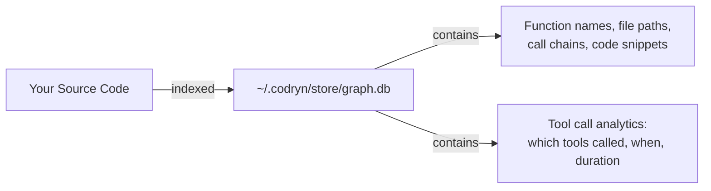

# Security

## Overview

`codryn` is a local-only tool. It runs entirely on your machine, stores data locally, and never sends anything to external servers.

---

## Security Properties

| Property | Detail |
|:---------|:-------|
| **Network (MCP mode)** | Communicates only via stdin/stdout. No network sockets opened. |
| **Network (UI mode)** | Binds to `127.0.0.1:9749` only. Not accessible from other machines. |
| **Outbound requests** | None. No update checks. No telemetry. No phone-home. |
| **API keys** | Not used or required. No cloud provider access. |
| **Credentials** | Does not store or transmit any credentials. |
| **Data storage** | `~/.codryn/store/graph.db` (SQLite). Delete to erase everything. |

---

## Data Storage

| What's stored | Detail |
|:--------------|:-------|
| Graph nodes | Function/class names, qualified names, file paths, line ranges |
| Graph edges | Call relationships, imports, inheritance |
| Code snippets | Compressed function bodies (for `get_code_snippet`) |
| Analytics | Tool name, agent name, duration, timestamps |
| Config | `~/.config/codryn/config.toml` (optional, no secrets) |
| **Not stored** | Full source files, secrets, credentials, environment variables |

---

## File Access

| Behavior | Detail |
|:---------|:-------|
| Source reading | Only reads files in repositories you explicitly index |
| No external access | Does not read files outside indexed project directories |
| `/api/browse` | Lists directories on local filesystem (for dashboard folder browser) |
| `/api/logo` | Serves image files from indexed project directories |

> ⚠️ The `/api/browse` endpoint is intentional for a localhost-only tool. Do not expose the port externally.

---

## Agent Configuration

| Action | What it does |
|:-------|:-------------|
| `codryn install` | Writes MCP config to agent dotfiles (`~/.claude/`, `~/.cursor/`, etc.) |
| `codryn install` | Writes instruction files (CLAUDE.md, AGENTS.md) that guide agents |
| `codryn uninstall` | Removes all of the above cleanly |
| `codryn install --dry-run` | Preview changes before writing |

---

## Supply Chain

| Component | How it's included |
|:----------|:------------------|
| Rust binary | Compiled to a single static binary |
| SQLite | Bundled via `rusqlite` (no system dependency) |
| tree-sitter grammars | Compiled at build time from C/C++ source |
| Angular dashboard | Embedded in binary at build time via `rust-embed` |
| Runtime downloads | None. No dynamic loading. |

---

## Recommendations

| # | Recommendation |
|:--|:---------------|
| 1 | **Don't expose the UI port externally** — `codryn --ui` binds to localhost. Don't reverse-proxy it. |
| 2 | **Treat graph.db as sensitive** — it contains your codebase structure (function names, file paths, call chains). |
| 3 | **Review before committing** — `codryn install` writes to dotfiles. Use `--dry-run` first. |
| 4 | **Delete when done** — `rm ~/.codryn/store/graph.db` removes all data. `codryn uninstall` removes configs. |

---

## Reporting Vulnerabilities

If you find a security issue, please open a GitHub issue or contact the maintainers directly. This is a local tool with no network attack surface in its default configuration, but we take all reports seriously.
