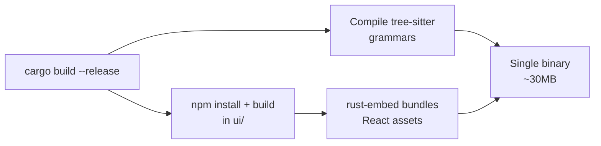

# Technical Decisions

Design rationale for the key technology choices in `codryn`.

---

## Why Rust?

| Concern | Node.js baseline | Rust (`codryn`) |
|:--------|:-----------------|:----------------|
| Distribution | Requires runtime + node_modules | Single static binary |
| Startup time | 200–500ms cold start | <10ms |
| Memory (50k files) | 500MB+ (GC overhead) | ~80MB (batch flushing) |
| Concurrency | Single-threaded + worker threads | Safe parallelism via ownership |
| UI embedding | Separate process or bundler | `rust-embed` compiles UI into binary |

MCP servers are spawned on demand by agents — fast startup and low memory matter.

---

## Why SQLite?

| Property | Benefit |
|:---------|:--------|
| Zero configuration | No database server to install |
| Single file | `~/.codryn/store/graph.db` — easy to backup or delete |
| Fast enough | Sub-millisecond queries with proper indexes |
| Bundled | `rusqlite` compiles SQLite from source (no system dep) |
| Concurrent reads | WAL mode allows MCP server + UI to read simultaneously |
| Portable | Database file works on any platform |

We considered embedded graph databases (sled, rocksdb) but SQLite's maturity, tooling, and Cypher-to-SQL translation made it the pragmatic choice.

---

## Why tree-sitter?

| Property | Benefit |
|:---------|:--------|
| 64 languages | Single parsing framework for all |
| Concrete syntax trees | Exact line numbers, qualified names, structural relationships |
| No language servers | Grammars compiled into binary, no LSP setup |
| Error tolerance | Partial parse trees accepted (error recovery) |
| Battle-tested | Used by GitHub, Neovim, Zed, Helix |

**vs Language Server Protocol (LSP):** LSP gives richer semantic info but requires installing a separate server per language. tree-sitter gives 80% of the value with zero runtime dependencies.

**Framework-specific extraction:** For Java/Kotlin (Spring Boot), Go, and Python (FastAPI), we use dedicated tree-sitter grammars for deterministic annotation extraction — far more reliable than regex for annotation-heavy frameworks.

**Fallback strategy:** tree-sitter is the primary parser with error tolerance. Only when no grammar exists does it fall back to regex with brace counting (or indentation detection for Python/Ruby).

---

## Why MCP?

| Property | Benefit |
|:---------|:--------|
| Agent-agnostic | Works with any MCP-compatible coding agent |
| No plugin per IDE | One binary serves all agents |
| Tool discovery | Agents auto-discover tools and schemas |
| Stdio transport | Simple, reliable, no port management |

[Model Context Protocol](https://modelcontextprotocol.io/) is an open standard. We chose it because one binary can serve every MCP-compatible agent without IDE-specific plugins.

---

## Why React for the Dashboard?

| Reason | Detail |
|:-------|:-------|
| Ecosystem | React + Vite + TypeScript matches modern frontend tooling |
| Canvas rendering | Custom Canvas + `d3-force` for large architecture graphs |
| Flow views | Sankey and lane layouts for backend request tracing |
| Build-time embedding | Static build output is bundled into the binary via `rust-embed` |

**Graph visualization:** Canvas-based force-directed layout with DPR-correct rendering, minimap, and incremental layout for large graphs.

**Relationship DAG:** Custom Canvas 2D renderer with layered layout, animated bezier edges, and drag-to-link for linked projects.

---

## Why Not a Graph Database?

| Concern | Native graph DB (Neo4j, DGraph) | SQLite + Cypher translator |
|:--------|:-------------------------------|:---------------------------|
| Server | Requires running process | No server needed |
| Deployment | Docker, ports, auth | Single file |
| Query complexity | Optimized for 5+ hops | Our queries are 1–3 hops |
| Cypher support | Native | Custom parser → SQL translation |

The tradeoff: deep traversals (5+ hops) are slower than a native graph DB. In practice, codebase queries rarely need more than 3 hops.

---

## Why Bidirectional Project Links?

| Property | Benefit |
|:---------|:--------|
| Symmetric queries | Searching A→B also works B→A |
| Simple lookups | `WHERE source_project = ?` (no OR conditions) |
| Idempotent | `INSERT OR IGNORE` — linking twice is a no-op |
| Cascade cleanup | Deleting a project removes all its links via FK |

---

## Build System

`make install` adds: copy to `~/.local/bin` + macOS code signing. If Rust isn't installed, the Makefile auto-installs via rustup.

---

## Full-Text Code Search (FTS5)

| Alternative | Why not |
|:------------|:--------|
| Tantivy | Additional dependency, separate index file |
| Meilisearch | External server process |
| SQLite FTS5 | ✅ Built into SQLite, same database, zero deps |

The `code_fts` virtual table stores symbol bodies indexed during extraction. `search_nodes_broad` merges name LIKE + FTS + properties LIKE results with deduplication. Porter stemming handles word variations automatically.

---

## Broad Search (No Synonym Map)

Instead of maintaining a synonym dictionary (update↔edit↔patch), we search three surfaces:

| Surface | What it matches |
|:--------|:----------------|
| Name/QN | Symbol names via LIKE |
| FTS code content | Identifiers inside function bodies |
| Properties | Annotations, HTTP methods, paths |

This catches most intent-based queries without synonym maintenance. "PATCH travelrequest" finds Route nodes via properties; "updateTravelRequest" finds methods via name match.

---

## Angular Selector Extraction

| Decision | Rationale |
|:---------|:----------|
| String matching (not regex) | Reliably extracts `selector: 'xxx'` from decorator body |
| Dedicated Selector nodes | Makes `find_symbol("app-user-card")` work |
| Constructor DI extraction | `constructor(private svc: ServiceName)` → INJECTS edges |
| Custom element regex for templates | Per HTML spec, tags with hyphens are always custom elements |
| Both external + inline templates | `.component.html` and `template: \`...\`` supported |

---

## Cross-Project MAPS_TO

| Decision | Rationale |
|:---------|:----------|
| Name-based matching | Same `name` field, both Class or Interface label |
| Simple and fast | Single SQL JOIN, no field-level analysis |
| High precision | Same-name types across linked projects are almost always related |
| Rebuilt on reindex | No stale edges, always reflects current state |

---

## Analytics Request/Response Logging

| Decision | Rationale |
|:---------|:----------|
| `Serialize` on all arg structs | Enables `serde_json::to_string(&args)` before dispatch |
| SQLite TEXT columns | `request_body` / `response_body` with `COALESCE` fallback |
| Recursive JSON tree in dashboard | Collapsible syntax-highlighted view (not raw `<pre>`) |
| Append-only, no body indexes | Negligible storage impact, no query overhead |
